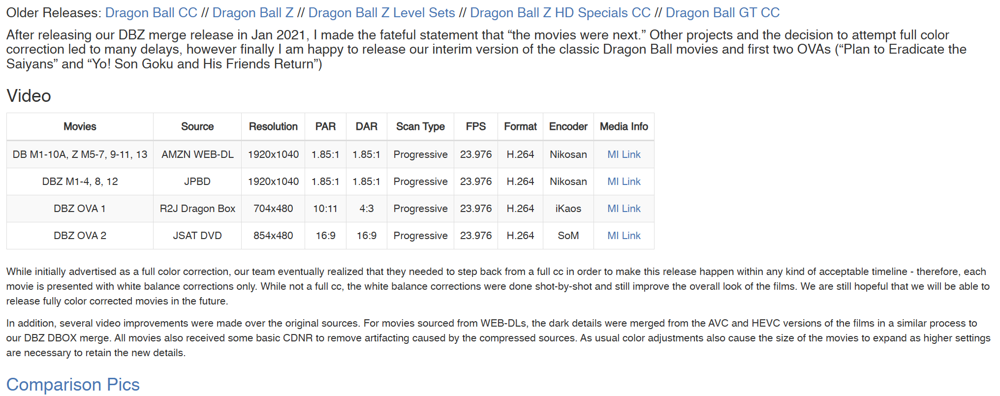
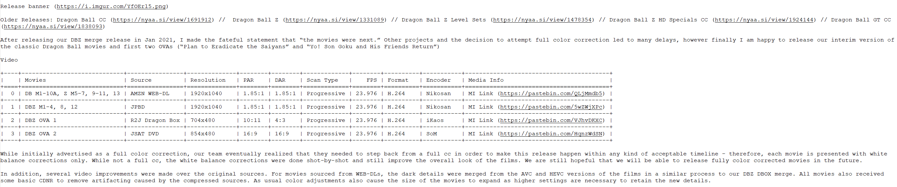

# NyaaScrape-qBittorrent
********************************

## Description:
A script packaged into an executable that scrapes the download page of [Nyaa.si](https://nyaa.si/), extracts information from the page, and writes it to a text file saved in the same location as the downloaded file. The script/executable first attempts to scrape the Nyaa pages. If that is unavailable, it falls back to scraping the cached Nyaa page through AnimeTosho. 
<BR><BR>
This program is useful for quickly referencing torrent details provided by the author from file explorer and ensuring torrent details is kept in the event the web page is taken down. Users who wish to archive or hoard data will find the most utility from this.
<BR><BR>
What information does this executable scrape?
- Title
- Date
- Submitter
- File Size
- Number of Completes
- Description
- URL of the page
- All comments
<BR><BR>

## Usage Notes:
A record of pages scraped is kept in a file located in the same directory as the executable called "downloads.txt". This acts as a record of torrents you've downloaded. If you want to scrape the same page again, you will have to manually find the record from this text file and delete its entry. This is quite trivial albeit a little tedious to do, but it is as simple as finding the record (kept per line) and deleting it.

## Prerequisites:
The following Python modules are required: bs4, requests, sys, os, pandas, tabulate, selenium, re, textwrap, shutil and glob, if choosing to use as this as a script only.
<BR><BR>
Note to non-Windows users: the filenames of the generated text files are Windows filename compliant, but were not checked to be compliant for macOS and Linux filename systems.
## Setup:
Download the release executable and place it executable anywhere.
<BR><BR>
In the settings of qBittorrent: Options -> Downloads -> Run external program -> Run on torrent finished
<BR><BR>
Check "Run on torrent finished", then add the line: `"path/to/executable/NyaaScrape-qBittorrent.exe" "%G" "%I" "%N" "%D" "%F" "%R"`

## Non-qBittorrent Use:
Users who want to scrape nyaa.si pages without qBittorrent can do so by using the python file (from src folder) as a script. They must provide as arguments infohashes of the torrent when calling the script (multiple infohashes supported) for the torrent pages they want to scrape from.
<BR><BR>
The files will be saved in a folder located in the same directory as the script called readmes.
<BR><BR>
Additionally, several flags are available:
- `--no-list`: scrapes the web page, ignoring downloaded.txt, but will do nothing if the file already exists in the readmes directory
- `--write-new`: scrapes the web page but only if it is not recorded in the downloaded.txt, records it in downloaded.txt, and if another copy exists in readmes, it will rename
- `--update`: scrapes web page, add to downloaded.txt, and renames file if another copy exists in readmes (probably what you want to use in most cases).
<BR><BR>
*No order on flags or URLs
<BR><BR>

## Examples:
#### General:
`python NyaaScrape-qBittorrent.py <flags> <infohash_here>`
#### Specific:
`python NyaaScrape-qBittorrent.py --update 5812b0b5b57f4c4bc814e4ad40a628dd9176d533`
<BR><BR>
## Example of Table Conversion From HTML to Plain Text:
  ##### <ins>Input:</ins>

  ##### <ins>Output:</ins>


## Update Considerations:
- Add proper table parsing for cached pages from animetosho like it exists for nyaa pages
- Optimize and reduce file size
- Refactor code
- Add intuitive (less technical) customizability for end-users (e.g. allow users a way to specify scraping the same page twice without needing to delete the entry in the downloads.txt)
- Provide non-Windows OSes support
- Fix possible logical errors regarding flags
- Add robustness to code
- Integrating proper sentiment analysis to filter for useful, constructive comments

## License
```
Copyright (c) 2025 Tony Nguyen

Permission is hereby granted, free of charge, to any person
obtaining a copy of this software and associated documentation files (the "Software"),
to deal in the Software without restriction, including without limitation the rights to use,
copy, modify, merge, publish, distribute, sublicense, and/or sell copies of the Software, and to
permit persons to whom the Software is furnished to do so, subject to the following conditions:

The above copyright notice and this permission notice shall be included in all copies or substantial
portions of the Software.

THE SOFTWARE IS PROVIDED "AS IS", WITHOUT WARRANTY OF ANY KIND, EXPRESS OR IMPLIED, INCLUDING
BUT NOT LIMITED TO THE WARRANTIES OF MERCHANTABILITY, FITNESS FOR A PARTICULAR PURPOSE AND NONINFRINGEMENT.
IN NO EVENT SHALL THE AUTHORS OR COPYRIGHT HOLDERS BE LIABLE FOR ANY CLAIM, DAMAGES OR OTHER LIABILITY,
WHETHER IN AN ACTION OF CONTRACT, TORT OR OTHERWISE, ARISING FROM, OUT OF OR IN CONNECTION WITH THE SOFTWARE
OR THE USE OR OTHER DEALINGS IN THE SOFTWARE.
```
