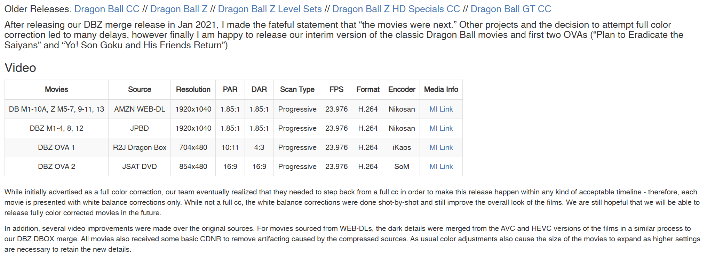

# NyaaScrape-qBittorrent
[](https://github.com/tony-vn/NyaaScrape-qBittorrent/releases)
[](https://github.com/tony-vn/NyaaScrape-qBittorrent/stargazers)
<!--********************************-->

## :pushpin: Overview:
NyaaScrape-qBittorrent is a Python-based tool that automatically saves the information of a **Nyaa.si** page in a text file in the same location of the torrented files for easy tracking of information of a particular downloaded release.

## :rocket: Features:
- Saves information from a Nyaa page **automatically** through qBittorrent's `Run on torrent finished` event.
- Scrapes **hidden** Nyaa pages
- Preserves **tables** and **all links** in text file.
- Allows users to easily access information of a particular torrent release through a text file next to their torrented files.
- Saves downloaded torrents in `downloaded.txt`.
- Available as an **executable** and an **open-source Python script(s)**.
- <ins>**NEW:**</ins> Scrape the Nyaa pages of **already downloaded** torrents, with text files automatically moved to the right folder (script only)

## :book: Description:
A script packaged into an executable that scrapes the download page of [Nyaa.si](https://nyaa.si/), extracts information from the page, and writes it to a text file saved in the same location as the downloaded file. The script/executable first attempts to scrape the Nyaa pages. If that is unavailable, it falls back to scraping the cached Nyaa page through AnimeTosho. 
<BR><BR>
This program is useful for being able to quickly reference torrent details provided by the torrent uploader from file explorer and ensuring torrent details is retained on your local machine in the event the web page is taken down. Users who archive or hoard data will find the most utility from this.
<BR><BR>
What **information** does this executable scrape?
- Title
- Date
- Submitter
- File Size
- Number of Completes
- Info hash
- Description
- URL of the page
- All comments

## :wrench: Setup:
### Option A: Executable
Download the release executable [here](https://github.com/tony-vn/NyaaScrape-qBittorrent/releases) and place it anywhere.
<BR><BR>
In the settings of qBittorrent: `Options -> Downloads -> Run external program -> Run on torrent finished`
<BR><BR>
Check "Run on torrent finished", then add the line: `"path/to/executable/NyaaScrape-qBittorrent.exe" "%G" "%I" "%N" "%D" "%F" "%R"`
### Option B: Python Script
When calling the script main.py (located in src folder), provide as arguments the **info hashes of the torrents (copy them through the torrent client if they're already there)**.
<BR><BR>
The files will be saved in a folder located in the **same directory** as the script called readmes.
<BR><BR>
Additionally, several flags are available:
- `--no-list`: scrapes the web page, ignoring downloaded.txt, but will do nothing if the file already exists in the readmes directory.
- `--write-new`: scrapes the web page, records it in downloaded.txt if it isn't already in the file, and if another copy exists in readmes, it will rename.
- `--update`: scrapes web page, add to downloaded.txt, and renames file if another copy exists in readmes (probably what you want to use in most cases).
- <ins>**NEW:**</ins> `--torrent-dir <directory>`: specify the location of where your downloaded torrent files are located and the script will scrape their web pages, automatically moving the text file to the location of their downloaded files.
  - `--infohash`: reads infohashes from infohash.txt located in the current script directory. One infohash per line. Meant to be used as an auxiliary flag for batch creation of text files for torrents already downloaded and existing on your drive.
<BR><BR>
#### Examples:
##### General:
`python main.py <flags> <infohash_here>`
##### Specific:
`python main.py --update 5812b0b5b57f4c4bc814e4ad40a628dd9176d533`<BR><BR>
`python main.py --torrent-dir "I:\Anime" --update --infohash`
<BR><BR>

## :tv: Sample:
  #### <ins>Input:</ins>
<kbd></kbd>
  #### <ins>Output:</ins>
<kbd></kbd>

## :pencil2: Usage Notes:
A record of pages scraped is kept in a file located in the same directory as the executable called "downloads.txt". This acts as a record of torrents you've downloaded. <BR>

If you want to scrape the same page again, you will have to manually find the line from this text file and delete it.
<BR><BR>
Note to non-Windows users: the filenames of the generated text files are Windows filename compliant, but were not checked to be compliant for macOS and Linux filename systems.

## :memo: Update Considerations:
- Add table parsing for cached animetosho pages like it exists for nyaa pages
- Optimize and reduce executable file size
- Refactor code
- Add intuitive (less technical) customizability for end-users (e.g. allow users a way to specify scraping the same page twice without needing to delete the entry in the downloads.txt)
- Non-Windows OS support
- Fix possible logical errors regarding flags
- Integrate proper sentiment analysis to filter for useful, constructive comments

## :triangular_flag_on_post: Problems:
Since this program relies on internet https requests, if you run into issues, double check your internet connection and speed. Slow VPNs or alternative DNS's may need to be turned off.

Please feel free to report any issues!

## :page_with_curl: License
```
Copyright (c) 2025 Tony N.

Permission is hereby granted, free of charge, to any person
obtaining a copy of this software and associated documentation files (the "Software"),
to deal in the Software without restriction, including without limitation the rights to use,
copy, modify, merge, publish, distribute, sublicense, and/or sell copies of the Software, and to
permit persons to whom the Software is furnished to do so, subject to the following conditions:

The above copyright notice and this permission notice shall be included in all copies or substantial
portions of the Software.

THE SOFTWARE IS PROVIDED "AS IS", WITHOUT WARRANTY OF ANY KIND, EXPRESS OR IMPLIED, INCLUDING
BUT NOT LIMITED TO THE WARRANTIES OF MERCHANTABILITY, FITNESS FOR A PARTICULAR PURPOSE AND NONINFRINGEMENT.
IN NO EVENT SHALL THE AUTHORS OR COPYRIGHT HOLDERS BE LIABLE FOR ANY CLAIM, DAMAGES OR OTHER LIABILITY,
WHETHER IN AN ACTION OF CONTRACT, TORT OR OTHERWISE, ARISING FROM, OUT OF OR IN CONNECTION WITH THE SOFTWARE
OR THE USE OR OTHER DEALINGS IN THE SOFTWARE.
```
